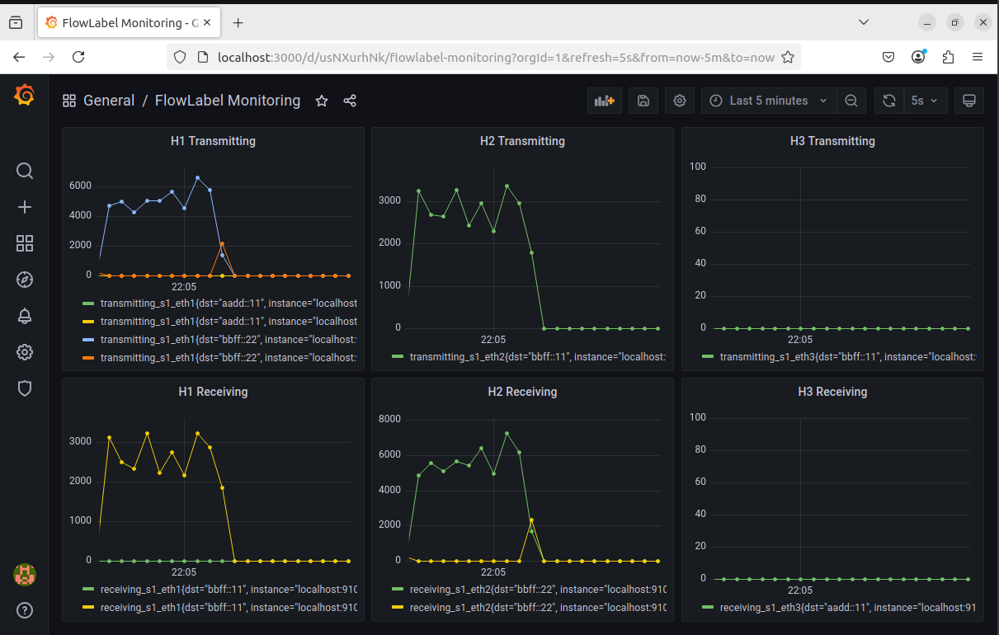
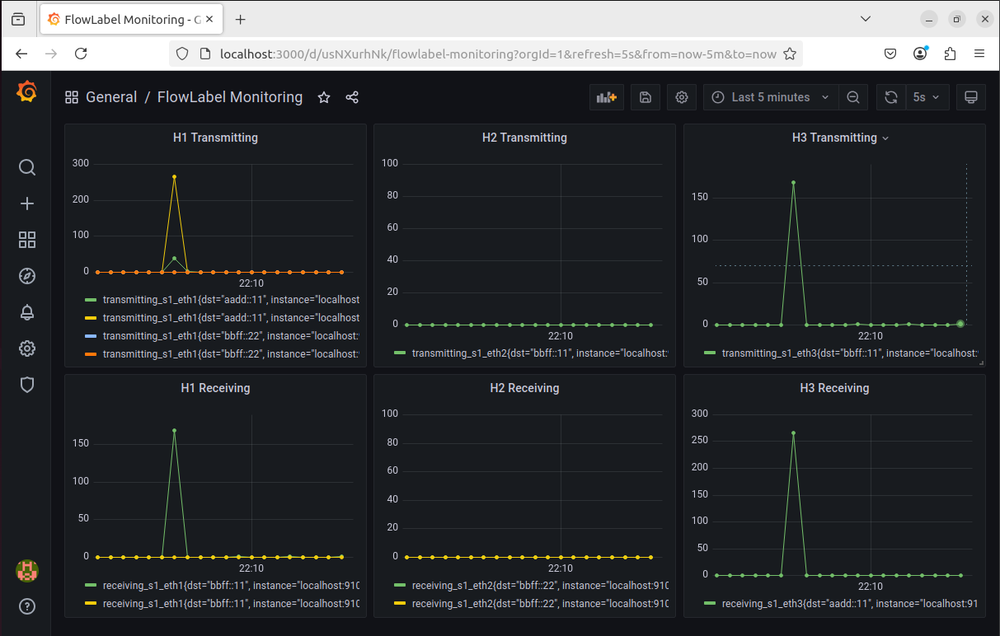
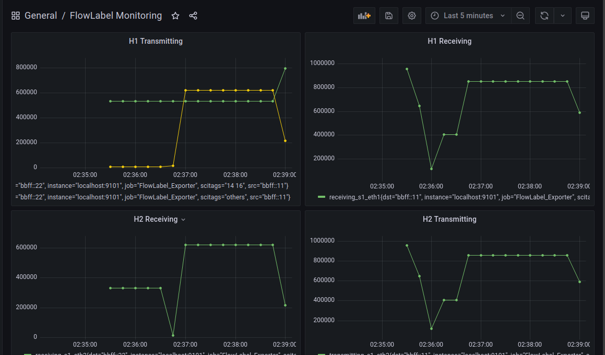
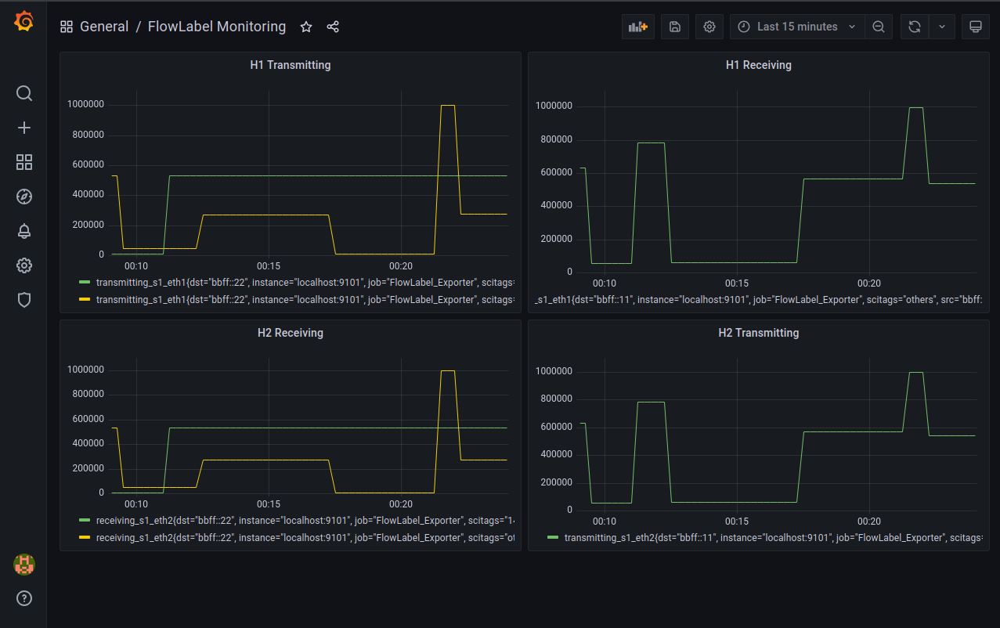

# Scitags-with-P4

## 20250417

- Change the topology configuration to distinguish internet and intranet

    intranet host h1: bbff:11, h2 bbff:22

    internet host h3: aadd::11

- Add the `flow_filter` to match the scitags in runtime. After match the specificed scitags flow, use the `dst_port_filter` to check whether the destination of the forwarded packet is the intranet. If it is not, drop the packet.

- Fix the FlowLabel_Exporter. 
    1. Record the timestamp of each packet and count the number of packets within a fixed time window, then upload the result to Prometheus. 
    2. Ensure the uploaded data is the total number of packets within 15 seconds, with the unit being packet count. 
    3. Use a timer or background thread to periodically calculate and update the Prometheus metric, ensuring it reflects the latest per-second packet count.

### h2 (intranet host) and h3 (internet host) request video file from h1

In the test, the video size is 80.2MB (80170781 bytes)

```
h1> python3 -m http.server 8000 --bind bbff::11
h2> curl -6 http://[bbff::11]:8000/video.mp4 -o h2_received_video.mp4
h3> curl -6 http://[bbff::11]:8000/video.mp4 -o h3_received_video.mp4
```

After testing, h2 successfully received the entire file (80.2MB, 80170781 bytes), while h3 only received a small portion of it (372.9KB, 372796 bytes)

This method can prevent larger files, such as video files, from being fully leaked. However, smaller files like text files, may still be leaked to the internet. The reason is that flowd takes time to detect a TCP connection and mark the packets, so some packets may be sent out before being marked.

The test results roughly meet the objectives specified in the prompt.

#### Monitoring in Grafana

h2 requests a video file from h1, and it can be seen that h1 forwards the packet with the specified scitags to h2 within the intranet.
 

h3 requests a video file from h1. It can be observed that h1 sends out packets with the specified scitags, but h3 does not receive any packets containing the specified scitags.


## 20250403

- Can not match scitags with runtime setting.

- Slicing flowlabel bits into activity and experiment. **(In P4, bit slicing is calculated from right to left)** Reversing experiment bits by bit shifting due to scitags' rule.

- Using if-statement to determine the given scitags.(Would like to look for alternative flexible methods.)

- Modifying send.py and receive.py to transmit data in TCP connection.

### Monitoring in Grafana
we can find that packets with specific scitags(activity:14, experiment:16) is transmited by h1 and h2 do not receive them. Others can received by h2.


## 20250320

- Monitor the packets sent and received by the host with Prometheus in FlowLabel_Exporter.py

- Use the host's network interface and transmitted/received packets for classification.

- Divide IPv6 packets' scitags into "14 16" and "others".

- Integrate information from Prometheus into Grafana's dashboard for data visualization.

### Experimental Commands
```
# start prometheus in port 9000
sudo prometheus --config.file=/etc/prometheus/prometheus.yml --web.listen-address=:9000
sudo python3 scitags/FlowLabel_Exporter.py

# start grafana (username: admin, password: admin)
in /usr/local/grafana/bin
    ./grafana-server &

# enter host's command line
sudo mnexec -a $(pgrep -f "mininet:h1") bash

in h1:
    python3 app.py
    sudo flowd -d
    iperf3 -c bbff::22 -t 60

in h2:
    iperf3 -s
```

### Monitoring in Grafana


## 20250314

- install [flowd](https://github.com/scitags/flowd) and set flowd.cfg
    ```
    PLUGIN='netstat'
    BACKEND='prometheus,ebpf'
    NETSTAT_EXPERIMENT=16
    NETSTAT_ACTIVITY=14
    NETWORK_INTERFACE='eth0'
    FLOW_MAP_API='http://localhost:5000/FlowMapAPI.json'
    PROMETHRUS_SRV_PORT=9000
    ```
    flow map api must connect to http/https but host in mininet can not connect to internet. I used the Flask package to write `app.py` and hosted `FlowMapAPI.json` on h1's localhost.

- `eBPF` is a tool for packet marking. During initialization, it sets up the network interface to be monitored. However, the host's interface is netem, which causes the program to fail.

    Therefore, in `ebpf.py`'s `ebpf_init()`, replace:
    ```
    ipr.tc("del", "sfq", idxdict[key], "10:")
    ```
    with
    ```
    ipr.tc("del", "netem", idxdict[key], "10:")
    ```

- Change the IPV6 address from `fd00::00/112` to `bbff::00/112` since netstat netstat does not accept private IPs.

- After starting app.py and flowd on h1, establish a TCP connection with h2 using `iperf3`. By observing h1's eth0 with Wireshark, we can see that the Flow Label field in the outgoing IPv6 packets is correctly marked.

## 20250304

- Add ipv6.p4. It's almost the same as basic.p4

- Hosts can ping each other with **IPV6** through fix NDP settings


## 20250303
- Building topology 

- Hosts can ping each other with **IPV4**

- Setting IPV6 route & NDP on Hosts
